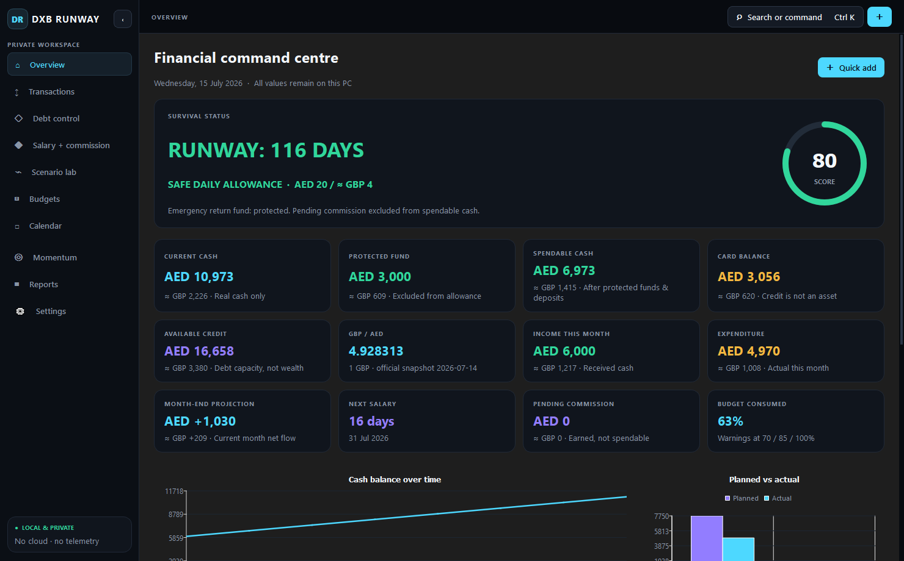
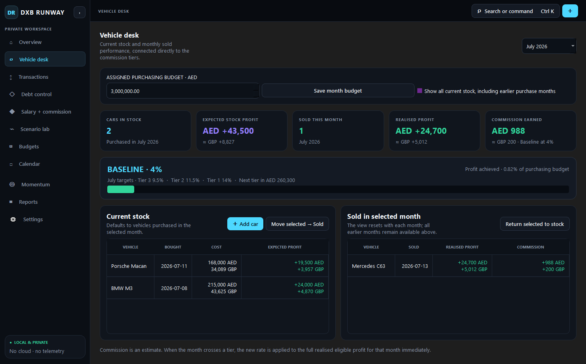

# DXB RUNWAY

DXB RUNWAY is a polished, completely local Windows and macOS financial command centre for a UK-to-Dubai relocation. It separates real cash, protected reserves, refundable deposits, debt and delayed commission so future upside never masquerades as money available today.





## What is included

- Responsive near-black PySide6 desktop UI with collapsible navigation and `Ctrl+K` command palette
- Dual runway view: an adjusted operating runway can add back marked relocation setup costs, while the actual-cash runway remains visible for safety; both stay synced to saved budgets, card minimums, salary-engine income and the next salary date
- Live daily spending guide enforcing an editable GBP 1,700 monthly cap, showing today's limit, spent today and left today in AED/GBP whenever Transactions change
- First-run onboarding with editable relocation assumptions
- AED/GBP transaction ledger, card-linked purchases and repayments, one-off setup-cost exclusions, persistent highlighted reminders, search, filters, CSV import/export, recurring flags, tags, local receipts, duplicate detection and undo delete
- Vehicle desk with current-month stock, expected profit, atomic stock-to-sold movement, monthly sales history and live tier-based commission
- Separate Vehicle Desk commission-only and total-earned cards, with total earned combining the purchasing-budget salary band and live monthly commission in AED/GBP
- Vehicle Desk automatically synchronises its live salary and commission result into pending earnings used by Overview, Calendar and Reports; Scenario Lab remains available for hypothetical modelling
- Modern colour-coded calendar with event dots, a focused daily view, Today shortcut and calm one-month-per-gesture scrolling
- Simple monthly payment dashboard with rent amount/due-date tracking, Calendar integration, transaction-linked paid totals and clear remaining balances for everyday categories
- Colour-coded sidebar with a standalone Overview and focused Leads, Money tracking and Misc / other sections
- AED remains the primary planning currency, with consistent `≈ GBP` translations across balances, transactions, earnings, scenarios, debt, budgets, reports and PDF exports
- Removable credit cards with limit-only editing, transaction-driven balances and available credit, utilisation warnings at 30%, 50%, 75% and 90%, interest estimates and repayment forecast
- Alba Motors salary and 2026 commission tiers, full-profit rate application, two-month payment scheduling, KPI deductions and cars-to-next-tier estimates
- Interactive scenarios through 24 months, emergency-fund breach detection and scenario comparison
- Monthly category budgets, survival budget, rollover flags and 70/85/100% warnings
- Financial calendar, goals, local PDF reports, portable backups and password-encrypted backups
- Versioned SQLite migrations and 41 automated tests
- No accounts, telemetry, analytics, external database or required internet connection

## Run the finished application on Windows

Use `dist\DXB RUNWAY.exe`. The first launch stores data in the Windows roaming AppData application directory selected by Qt, normally:

```text
%APPDATA%\DXB Runway\DXB RUNWAY\
```

The database is `dxb_runway.db`; local receipt copies are under `receipts\`. Portable backups can be saved anywhere from Settings.

## Run on macOS

Each GitHub release includes native ZIP builds for Apple Silicon and Intel Macs. Unzip the correct download, drag `DXB RUNWAY.app` into Applications, then Control-click it and choose **Open** on the first launch. The Mac builds are ad-hoc signed but not Apple-notarised, so a managed company Mac may require IT approval.

Move existing Windows data with **Settings → Create portable backup**, then use **Settings → Restore backup** on the Mac. See [MACOS.md](MACOS.md) for the exact installation, processor-choice and transfer steps.

## Run from source

Requirements: Windows 10/11 x64 or macOS 14+, and Python 3.12.

```powershell
py -3.12 -m venv .venv
.\.venv\Scripts\Activate.ps1
python -m pip install -r requirements.txt
$env:PYTHONPATH = "src"
python -m dxb_runway
```

For a disposable demo profile:

```powershell
$env:PYTHONPATH = "src"
python -m dxb_runway --data-dir .\work\demo --demo --skip-onboarding
```

## Test and build

`build.ps1` recreates the verified flow: dependencies, all tests, then the one-file PyInstaller executable.

```powershell
.\build.ps1
```

Manual commands:

```powershell
$env:QT_QPA_PLATFORM = "offscreen"
python -m pytest
Remove-Item Env:QT_QPA_PLATFORM
python -m PyInstaller --noconfirm --clean DXB_RUNWAY.spec
```

The executable is written to `dist\DXB RUNWAY.exe`. If Inno Setup 6 is installed, compile `installer\DXB_RUNWAY.iss` to produce `dist\DXB-RUNWAY-Setup.exe`.

## Keyboard shortcuts

- `Ctrl+K`: command palette
- `Ctrl+N`: quick-add transaction
- `Ctrl+1`: overview
- `Ctrl+2`: transactions
- `Ctrl+3`: scenario lab
- `F5`: refresh all screens

In Transactions, select any row and click `Highlight row` to add or clear a persistent amber reminder. The entire transaction row is coloured amber without adding a star or extra flag text. Highlighted transactions can be isolated from the filter menu, and existing notes appear when hovering over the row.

## Vehicle desk

Add a car with a short name, purchase price, expected sale price and purchase date. The current stock view defaults to cars bought during the selected month; an optional toggle reveals older unsold stock. Moving a selected vehicle to Sold asks only for its actual sale price and date, then removes it from stock immediately.

The Sold side always reflects the selected sale month, so a new calendar month starts with a fresh view while earlier months remain accessible from the month selector. If the app remains open across a month boundary while showing the current month, it rolls forward automatically. Realised profit is summed live, the month-of-year target percentages are selected automatically, and the achieved rate is applied to the full eligible monthly profit. The assigned purchasing budget is stored separately for each month, with live AED and GBP budget remaining after every vehicle purchased in that month.

## Architecture

```text
src/dxb_runway/
  app.py           application bootstrap, AppData and screenshot mode
  database.py      migrations, repository, receipts, CSV and backups
  domain.py        Decimal-based financial rules and forecasts
  dialogs.py       onboarding, transactions and command palette
  screens.py       complete desktop feature pages
  main_window.py   responsive navigation shell and shortcuts
  reporting.py     professional local PDF export
  style.py         cohesive dark design system
  widgets.py       reusable metrics, rings and QtCharts
tests/              domain, persistence and UI smoke coverage
```

The financial engine uses `Decimal` and explicit two-decimal rounding for monetary outputs. The SQLite schema is documented in `schema.sql`; runtime migrations remain authoritative in `database.py`.

The bundled GBP/AED snapshot is **1 GBP = AED 4.928313**, published by the Central Bank of the UAE on 14 July 2026. The rate and its update metadata are visible in Settings. Because the app is deliberately offline, update the manual rate there whenever you want a newer snapshot; every GBP equivalent then recalculates from that one value.

## Privacy and recovery

DXB RUNWAY has no network client code. Exchange rates are manual. Receipts are copied to the local application folder. A restore automatically preserves the current database as a timestamped `pre-restore-*.db` file. Encrypted backups use Scrypt key derivation and Fernet authenticated encryption; losing the password means losing access to that backup.

Version 1.5 introduces a product-wide visual refresh built for desktop financial work: restrained, local-first information structure with colourful charts, progress accents, transaction category icons and subtle page motion. It does not change financial features, calculations or stored data.

See [ASSUMPTIONS_AND_LIMITATIONS.md](ASSUMPTIONS_AND_LIMITATIONS.md) before relying on forecasts.
